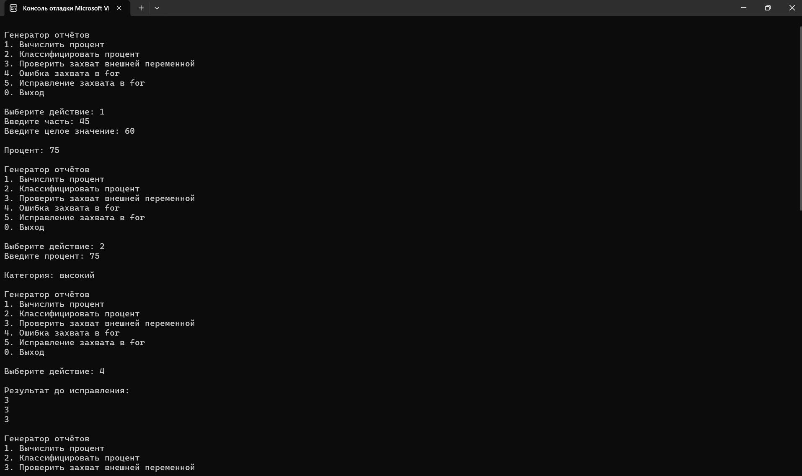
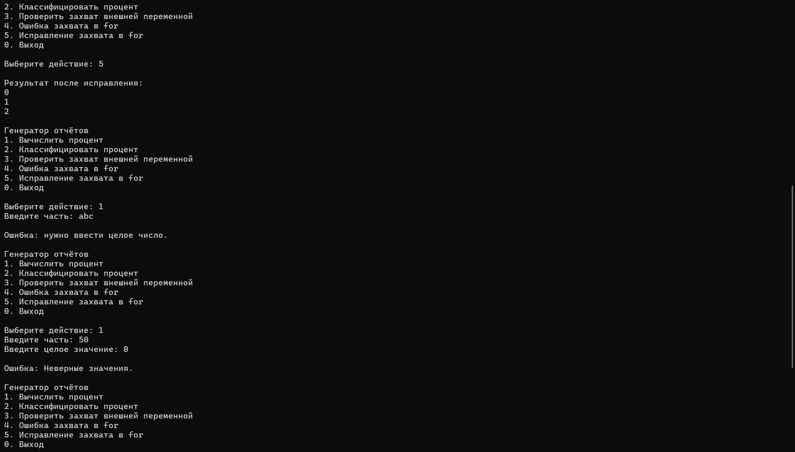

# LambdaExpressions
## КТ №18 Лямбда-выражения

# Вариант 1. Генератор отчётов
1. Func<int, int, int> через лямбду с телом-выражением — вычисляет процент ((часть * 100) / целое).
2. Func<int, string> через лямбду с телом-блоком из нескольких строк — классифицирует процент в текстовую категорию ("низкий"/"средний"/"высокий") через несколько if/return.
3. Лямбда, захватывающая внешнюю переменную (например, название отчёта), и демонстрация того, что изменение этой переменной после создания лямбды влияет на её поведение.
4. Воспроизведите проблему захвата переменной цикла for: создайте список из трёх лямбд Action, каждая должна была бы печатать «свой» номер отчёта (0, 1, 2), но из-за захвата общей переменной все печатают одно и то же финальное значение.
5. Исправьте пункт 4, скопировав переменную цикла в локальную переменную внутри тела цикла, и продемонстрируйте, что теперь печатаются разные значения.

## Результаты и проверочные ключи
| Действие | Ожидаемый результат |
| :--- | :--- |
| вычисление процента, например (45, 60) | 75 |
| классификация 75 | "высокий" (или аналогичная категория по вашей шкале) |
| до исправления: 3 лямбды из цикла for | все печатают одно и то же финальное значение (например, 3) |
| после исправления: те же 3 лямбды | печатают 0, 1, 2 — разные значения |

# Результат КТ

